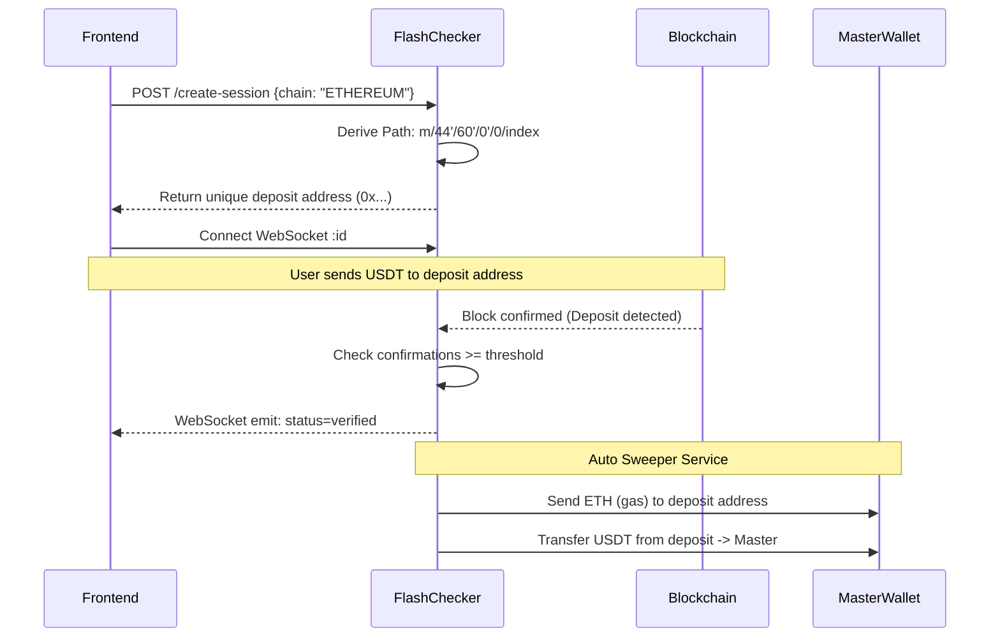

<div align="center">
  <h1>⚡ FlashChecker</h1>
  <p><strong>Multi-Chain USDT Deposit Verification & Sweeper System</strong></p>
</div>

A production-ready TypeScript backend that securely handles multi-chain blockchain payments. It generates deterministic deposit addresses via HD derivation, listens for transaction confirmations across EVM, Tron, and Solana networks, and securely consolidates collected funds to a master wallet.

---

## ⛓ Supported Chains & Assets

| Chain | Token Standard | Asset Supported |
|-------|---------------|---------------|
| **Ethereum** | ERC-20 | USDT |
| **BNB Smart Chain** | BEP-20 | USDT |
| **Tron** | TRC-20 | USDT |
| **Solana** | SPL | USDT |

---

## 🏗 Architecture & Data Flow

```mermaid
graph TD
    classDef client fill:#2B6CB0,stroke:#fff,stroke-width:2px,color:#fff;
    classDef server fill:#1A202C,stroke:#4A5568,stroke-width:2px,color:#fff;
    classDef chain fill:#38A169,stroke:#fff,stroke-width:2px,color:#fff;
    classDef db fill:#3182CE,stroke:#fff,stroke-width:2px,color:#fff;

    Client[Frontend Client]:::client -->|POST /create-session| API[Express API]:::server
    API -->|Generate HD Address| WalletService[HD Wallet Service]:::server
    API -->|Save Pending| DB[(PostgreSQL)]:::db
    
    API -->> Client: Return Deposit Address & Socket ID

    Client -->|Connect with ID| WS[WebSocket Server]:::server
    
    Node[Blockchain Nodes (RPC/WSS)]:::chain -->|Listen for Transfers| Listener[Chain Listeners]:::server
    Listener -->|Update Confirmations| DB
    
    Listener -->|Required Confirmations Met| WS
    WS -->> Client: "session_verified"

    Listener -->|Mark Verified| Sweeper[Sweeper Daemon]:::server
    Sweeper -->|Transfer Funds to Master| Node
```

---

## 🚀 Quick Start

### 1. Prerequisites
- Node.js 18+
- PostgreSQL Database
- BIP-39 mnemonic phrase (for generating deterministic wallets)
- RPC HTTP/WSS Endpoints (Infura/Alchemy/Helius/TronGrid)

### 2. Setup

```bash
# Clone and install dependencies
git clone https://github.com/arbazxkr/FlashChecker.git
cd FlashChecker
npm install

# Configure environment
cp .env.example .env
# Important: Add your MASTER_MNEMONIC and RPC keys to .env
```

### 3. Database Initialization

```bash
# Generate Prisma client
npx prisma generate

# Run migrations
npx prisma migrate dev --name init
```

### 4. Running the Application

```bash
# Development (with auto-restart)
npm run dev

# Production
npm run build
npx prisma migrate deploy
npm start
```

---

## 📡 Core Flow & Sequence



---

## 🔒 Security Features

| Feature | Description |
|---|---|
| **HD Derivation** | Unique addresses per session. Private keys are derived entirely in memory and never stored in the database. |
| **Atomic Allocation** | `$transaction` upserts prevent derivation index collisions across concurrent requests. |
| **Rate Limiting** | Endpoint and IP-based rate limiting via Express middlewares. |
| **Zod Validation** | Strict type checking on payload and environment variables preventing injection vectors. |
| **Idempotent Webhooks** | Optimistic locking prevents double-verification of the same blockchain sequence. |

---

## 📁 Project Structure

```
FlashChecker/
├── src/
│   ├── config/              # RPC settings, Contract ABIs, validation
│   ├── lib/                 # Prisma DB instance & WebSocket initialization
│   ├── services/
│   │   ├── listeners/       # Real-time WebSocket scraping for blockchains
│   │   ├── sweeper/         # Consolidating generated wallets -> master
│   │   └── wallet/          # Hierarchical Deterministic wallet derivation
│   ├── middleware/          # Rate limiting, Error Handling, Zod Parsing
│   ├── routes/              # Express API paths
│   └── server.ts            # Entrypoint
├── prisma/                  # DB schema definitions
└── .env.example             # Required env vars template
```

---
*Developed for robust, multi-chain liquidity aggregation.*
